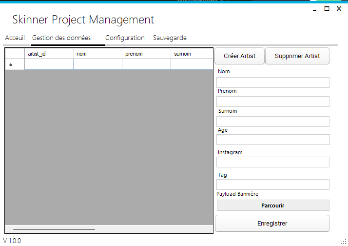

<h1 align="center">
  <br>
  <a href="https://www.google.com/imgres?imgurl=https%3A%2F%2Fvuejsdevelopers.com%2Fimages%2Fposts%2Fvue_laravel_crud.png&imgrefurl=https%3A%2F%2Fvuejsdevelopers.com%2F2018%2F02%2F05%2Fvue-laravel-crud%2F&tbnid=qFe6V2oOkzjqNM&vet=12ahUKEwid4eqSzaD9AhXpBkQIHfTOC18QMygEegUIARCUAQ..i&docid=tCHlzhKvgQrDSM&w=1200&h=642&q=vuejs%20and%20laravel%20logo.png&ved=2ahUKEwid4eqSzaD9AhXpBkQIHfTOC18QMygEegUIARCUAQ"></a>
  <br>
  Skinner Project's tatoo library
  <br>
</h1>

<h4 align="center">A beautiful interface made with <a href="https://laravel.com/" target="_blank">Laravel</a> and <a href="https://vuejs.org/" target="_blank">Vue.JS</a> and completing with  <a href="https://threejs.org/" target="_blank">ThreeJS</a> and <a href="https://tailwindcss.com/" target="_blank">tailwindCSS</a>.</h4>

<p align="center">

</p>

<p align="center">
  <a href="#key-features">Key Features</a> •
  <a href="#how-to-use">How To Use</a> •
  <a href="#download">Download</a> •
  <a href="#credits">Credits</a> •
  <a href="#related">Related</a> •
  <a href="#license">License</a>
</p>


<!--  -->

## Key Features

- [ ] Dark/Light mode
- [X] Live update - Make changes, See changes
  - Instantly see what your 3d model look like on the interface.
- [X] .NET software
  - Artists management with their tag to filter them.
  - Artist's models management with 3d model (not stacked in db but directly in storage of the interface)
  
- [x] Interface fully responsive for mobile application
- [x] Filter artists by their type
- [X] ThreeJS integration with laravel
- [X] Support GLB and GLTF to preview different tatoo made by many artists.
- [X] Usefull to compile with docker-compose
- [X] Full interface communicate with BackEnd
- [X] Cross platform
  - Windows, macOS and Linux ready.

## How To Use

To clone and run this application, you'll need php and [Git](https://git-scm.com) and [Node.js](https://nodejs.org/en/download/) (which comes with [npm](http://npmjs.com)), you also need docker installed on your computer. From your command line:

```bash
# Clone this repository
$ git clone https://github.com/clementfleur/tatoo-library.git

# Go into the repository
$ cd tatoo-library

# move .env.example to .env for dev environment
$ mv .env.example .env

# Install dependencies
$ make install
# OR avoiding installing Make
$ docker-compose up -d

# Run the app
$ yarn run dev
```

> **Note**
> If you're using Linux Bash or WSL on Windows, please be sure to have docker-compose's integration with WSL.


## Download

You can [download](https://github.com/clementfleur/tatoo-library/releases/tag/V1) the latest installable version of tatoo's library for Windows, macOS and Linux.

## Credits

This software uses the following open source packages:

- [Laravel](https://laravel.com/)
- [Vue.js](https://vuejs.org/)
- [Three.js](https://threejs.org/)

## Related

[Tatoo Library's management software](https://github.com/clementfleur/tatoo-library-software) - Software Application management of the web interface

## You may also like...

- [My School project](https://github.com/clementfleur/Epitech_Project) - From my first year to my third year.

## License

MIT

---

> GitHub [@clementfleur](https://github.com/clementfleur)
> Twitter [@BartzGame](https://twitter.com/BartzGame)
> Discord <a> @Bartz#8618 </a>

